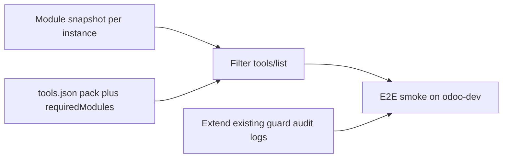

# Enterprise Packs — Diet E2E (v0.6 + v0.7 slim)

## Progress — Complete (2026-07-21)

Overall progress: **100% (6/6 plan items completed)** on `release/v0.6.0`.

| Wave | Status | Delivered evidence |
| --- | --- | --- |
| Branch | Complete | Work remains on `release/v0.6.0`; existing mutation/capability changes were preserved. |
| Slim docs | Complete | Added `docs/src/developer/enterprise-packs-diet.md`, linked it from mdBook SUMMARY, and kept the large `.plan/` overlay non-canonical. |
| Module snapshots | Complete | Added `mcp/module_snapshot.rs` with per-instance installed-module scans, JSON persistence, TTL, explicit refresh, config-reload invalidation, and stale-on-failure preservation. |
| Pack metadata/filtering | Complete | Added optional `pack`/`requiredModules`, per-instance `disabledPacks`, standard and instance-scoped `tools/list` filtering, and matching direct-call denial. |
| Guard audit | Complete | Added metadata-only `tool_policy_decision` events for environment guards, controlled/read-only mode, disabled tools/packs, and missing modules. |
| E2E smoke | Complete | Added ignored live test `module_capabilities_live.rs`; Odoo 18 CE proved hidden with `stock` absent (64 modules) and visible with `stock` installed (75 modules). |

Validation completed:

- Rust formatting passed.
- Clippy passed with warnings denied.
- Rust suite passed: **401 tests**, plus one ignored live-only test.
- Config UI lint/typecheck/build passed; **195 tests** passed. Lint retains one unrelated pre-existing hook warning.
- Independent implementation review returned **PASS** after fixes for standard unscoped `tools/list` filtering and the UI `requiresEnvTrueAll` type.
- Version metadata is synchronized at `0.6.0` across Rust, Config UI, desktop manifests, README, and changelog.

No commit, push, tag, or PR has been created. `mdbook build` was skipped because `mdbook` is not installed locally; it is not part of this plan's required validation commands.

## Verdict (aligned with Claude review)

Overlay [`.plan/odoo-rust-mcp-enterprise-packs-dev-docs`](.plan/odoo-rust-mcp-enterprise-packs-dev-docs) (~2.9k lines, v0.6–v1.0, 15 epic, workflow/SQLite/tokens/adapters) is **over-engineered for this repo**. Current architecture (declarative `tools.json` + env guards + multi-instance) already avoids the “375-tool MCP” problem that case study solves.

**Worth ~20% effort / ~80% value:**

1. **Capability snapshots** — don’t expose CRM/MRP tools when the module isn’t installed.
2. **`pack` grouping on tool defs** — one optional field + filter; not pack YAML / resolver / exposure profiles.
3. **Policy audit as guard extension** — build on `readOnly`, execute allowlist, controlled mode, existing mutation envelope; not a new Policy Engine.

**Skip / YAGNI until real demand:**

- Workflow runtime (runner, resume, compensation, SQLite) — belongs in the MCP *client/agent*
- Compatibility adapter matrix Odoo 16–19 — dual client already covers protocol; per-method adapters are speculative
- 12 domain packs (Website publish, POS close, Spreadsheet, Employee, …)
- New signed confirmation-token service — env guards + existing `odoo_execute_capability` HMAC are enough for local/single-user; revisit only for multi-tenant HTTP
- Landing the full docs tree into mdBook (historical overlay stays under `.plan/`)
- Named Manufacturing tool suite (`mrp_order_*`, etc.) — use existing `search`/`read` + module gating first



## Locked defaults

- Branch = **`release/v0.6.0`** (created from `dev`; carries existing uncommitted mutation/capability work). All diet work lands here.
- Scope = **diet v0.6 + v0.7 only**. v0.8–v1.0 deferred indefinitely.
- No `ToolPack` trait, no pack manifest YAML, no exposure profile resolver, no workflow store.
- No wholesale copy of enterprise-packs docs into [`docs/src/`](docs/src/).
- Reuse [`capability.rs`](rust-mcp/src/mcp/capability.rs) mutation path as-is; **module snapshot is a separate small module** (name clearly, e.g. `module_snapshot.rs`) so it doesn’t tangle with the HMAC executor.
- Version matrix for smoke: odoo-dev **17/18/19 CE+EE** when available; start with whichever cell is up (today often `odoo18ce:18069`).
- Skills ([`ocloud-odoo-skills`](/home/milzam/Workspace/skills/ocloud-odoo-skills)): reference for version/edition evidence patterns only; do not approve mutation cells in this slice.

## What already covers “policy / confirmation”

Do **not** rebuild:

- [`odoo_execute_capability`](rust-mcp/src/mcp/capability.rs) + HMAC + idempotency + receipts
- [`oc_mcp_mutation`](odoo-addons/oc_mcp_mutation/)
- `ODOO_CAPABILITY_CONTROLLED_MODE`, write/cleanup/execute env guards, instance `readOnly`

Slice only adds: optional **audit decision log line** when a tool is skipped (missing module / pack disabled) or a guard denies — same logging style as v0.5.3 (metadata only, no args/results).

## Implementation

### Wave 0 — Slim docs (not the overlay dump)

- Add one short developer note or ADR under `docs/src/developer/` (~1–2 pages): diet scope, what ships, what is deferred and why (point at `.plan/...` as non-canonical brainstorm).
- Do **not** merge the full SUMMARY-snippet / 12 pack pages / workflow/policy epics.

### Wave 1 — Module capability snapshot

Minimal scan (Stages A–B, light C):

- Per instance: Odoo version/edition from config + installed modules via `ir.module.module` (`state=installed`).
- Cache JSON snapshot under config dir; TTL + explicit refresh tool or config-save reload.
- Failed refresh → keep last snapshot, mark `stale`; never wipe to empty.
- Optional resource: `odoo://{instance}/capabilities` listing modules + skip reasons (extend [`resources.rs`](rust-mcp/src/mcp/resources.rs) only if cheap).

### Wave 2 — `pack` + `requiredModules` on tools

In [`tools.json`](rust-mcp/config/tools.json) / ToolDef / registry:

```json
"pack": "crm",
"requiredModules": ["crm"]
```

- Registry filters `tools/list` (and call path) per selected instance snapshot.
- Missing module → tool omitted (or call denied with clear reason if somehow invoked).
- Tag existing tools with packs opportunistically (`core`, `crm`, `sales`, …) — **no new domain tools** in this slice.
- Cursor-safe schema only (no anyOf/oneOf).

### Wave 3 — Guard audit extension

- When skip/deny happens (module, pack, env guard, controlled mode), emit one structured audit/trace event (instance, tool, reason code).
- No declarative policy YAML, no impact preview tokens, no confirmation challenge flow beyond what mutation envelope already does.

### Wave 4 — E2E smoke

Against [`odoo-dev/environments`](/home/milzam/Workspace/odoo-dev/environments):

1. Point MCP at a cell; refresh snapshot.
2. Assert tools with `requiredModules: ["mrp"]` hidden when `mrp` absent; visible when installed (install or pick a DB that has it).
3. One runnable check in CI-optional / `scripts/` or ignored-by-default integration test (live Odoo not required for unit tests of filter logic).

Ports: 17ce `17069`, 17ee `17070`, 18ce `18069`, 18ee `18070`, 19ce `19069`, 19ee `19070`.

## Explicitly out of scope

- Workflow runtime / SQLite / resume / compensation
- Pack resolver, exposure profiles, Config UI pack matrix
- Manufacturing/POS/Website/Employee named tool packs
- Odoo 16 adapters; per-method compatibility matrix
- New HMAC confirmation service
- Promoting mutation support cells in skills
- Shipping the full enterprise-packs documentation set

## Validation

```bash
cargo fmt --all --check --manifest-path rust-mcp/Cargo.toml
cargo clippy --all-features --manifest-path rust-mcp/Cargo.toml -- -D warnings
cargo test --all-features --manifest-path rust-mcp/Cargo.toml
```

Acceptance:

- Tool with missing `requiredModules` does not appear for that instance
- Stale snapshot preserved on failed refresh
- Pack field round-trips in config without breaking Cursor schemas
- Audit/skip reason logged without leaking args
- Mutation/`capability.rs` behavior unchanged

## Conflict note

Preserve uncommitted mutation work on `dev`. Keep module-snapshot code separate from the HMAC capability executor naming.
