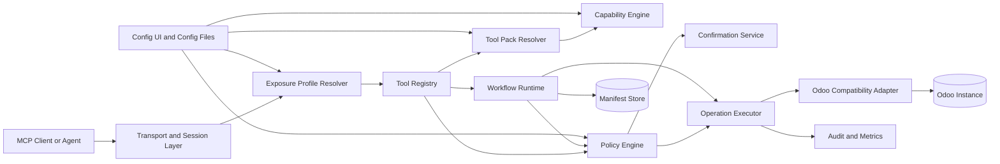
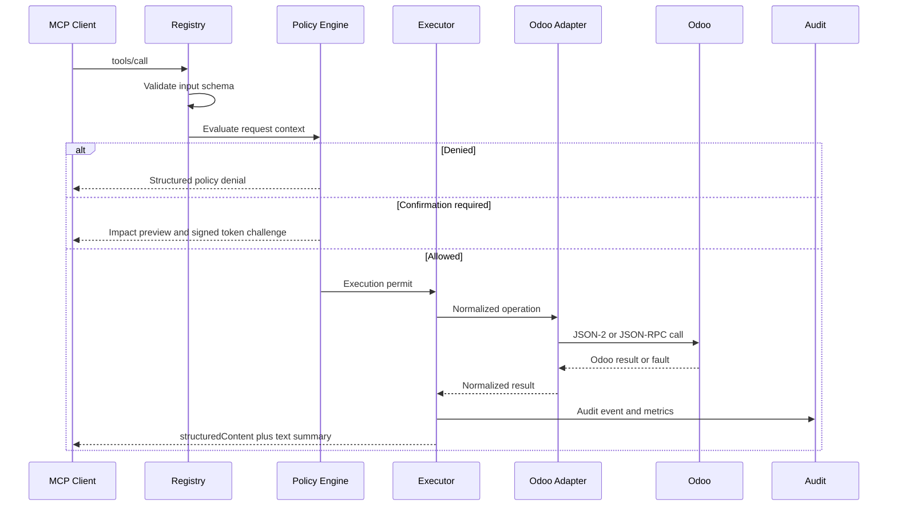

# Architecture

## 1. Context

`odoo-rust-mcp` already supports multiple Odoo versions, multiple transports,
multiple instances, a declarative registry, and a Config UI. Enterprise Packs
add capability-aware domain registration and controlled execution.

## 2. Logical architecture



## 3. Runtime request path



## 4. Major components

### 4.1 Exposure Profile Resolver

Reduces the visible tool set based on:

- selected instance;
- actor role;
- enabled packs;
- read-only status;
- client profile;
- environment;
- optional task profile.

Recommended profiles:

- `minimal-read`
- `analyst`
- `operator`
- `domain-admin`
- `developer`
- `full-admin`

The default production profile must not expose arbitrary execute, delete, or
workflow-action tools.

### 4.2 Tool Registry

Responsibilities:

- unique tool-name enforcement;
- schema validation;
- metadata indexing;
- pack ownership;
- output-schema registration;
- tool annotations;
- registry revision;
- list-changed notification generation.

### 4.3 Tool Pack Resolver

Loads packs only when:

- pack is enabled;
- required Odoo modules are installed;
- version constraints pass;
- required models and fields are available;
- required access checks pass;
- edition and deployment constraints pass;
- policy does not globally disable the pack.

### 4.4 Capability Engine

Builds an evidence-based capability snapshot. It does not assume that module
installation or ACL presence alone guarantees successful execution.

### 4.5 Policy Engine

Evaluates declarative rules against:

- actor;
- instance;
- tool;
- pack;
- model and method;
- record IDs and count;
- record state;
- company;
- monetary amount and currency;
- personal-data classification;
- request environment;
- dry-run and confirmation status.

### 4.6 Confirmation Service

Issues short-lived signed tokens bound to the exact normalized request and
impact preview.

### 4.7 Workflow Runtime

Runs deterministic, declared workflows. It stores step-level manifests and
supports dry-run, idempotency, resume, and explicit compensation.

### 4.8 Compatibility Adapter

Maps domain operations to version-specific Odoo models, methods, fields, and
contexts.

## 5. Deployment modes

### Instance-scoped server

Recommended for production.

```text
one MCP process -> one Odoo instance -> one exposure profile
```

Benefits:

- accurate tool list;
- smaller context;
- simpler policy;
- easier tenant isolation.

### Shared multi-instance server

Useful for administration and development.

Constraints:

- tool availability can differ by instance;
- every call must include an instance;
- tool list should expose only safe common tools or clearly conditional tools;
- clients may not support dynamic tool-list behavior consistently.

## 6. Persistence

### MVP

- capability snapshot: JSON;
- workflow manifests: atomic JSON;
- audit: JSONL;
- secrets: existing secure configuration mechanism.

### Production Standard

- SQLite with WAL;
- migration scripts;
- retention policies;
- scheduled backup.

Do not add PostgreSQL or Redis until concurrency, shared execution, or high
availability justifies the operational burden.

## 7. Failure boundaries

- MCP transport failure does not imply Odoo transaction failure.
- Odoo call timeout may leave outcome uncertain.
- Cross-call workflows are not atomic.
- Retry is allowed only for idempotent operations or after outcome
  reconciliation.
- Workflow resume must inspect the current Odoo state before repeating a step.

## 8. Repository target structure

```text
rust-mcp/src/
├── mcp/
│   ├── registry/
│   ├── exposure/
│   ├── capability/
│   ├── policy/
│   ├── confirmation/
│   ├── workflow/
│   ├── audit/
│   └── transports/
├── odoo/
│   ├── client/
│   ├── compatibility/
│   ├── operations/
│   └── errors/
└── packs/
    ├── core/
    ├── crm/
    ├── sales/
    ├── purchase/
    ├── inventory/
    ├── accounting/
    ├── project/
    ├── manufacturing/
    ├── website/
    ├── spreadsheet_dashboard/
    ├── pos/
    └── employee/
```
