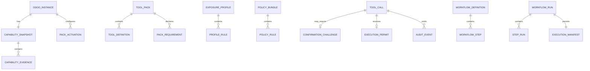

# Domain Model

## 1. Core entities

## 2. OdooInstance

Represents one configured Odoo database endpoint.

Fields:

- `id`
- `name`
- `base_url`
- `database`
- `odoo_version`
- `edition`
- `deployment_type`
- `auth_mode`
- `company_scope`
- `tags`
- `enabled`
- `read_only`
- `default_profile`
- `capability_ttl_seconds`

## 3. CapabilitySnapshot

Immutable snapshot of discovered capabilities.

Fields:

- `snapshot_id`
- `instance_id`
- `schema_version`
- `odoo_version`
- `edition`
- `deployment_type`
- `authenticated_user_id`
- `authenticated_user_groups`
- `installed_modules`
- `model_capabilities`
- `feature_flags`
- `discovery_errors`
- `created_at`
- `expires_at`
- `source_hash`

A new scan creates a new snapshot. It does not mutate historical evidence.

## 4. ModelCapability

Fields:

- `model`
- `available`
- `read`
- `create`
- `write`
- `unlink`
- `methods`
- `fields`
- `record_rule_probe_status`
- `deployment_restrictions`
- `evidence_level`

Evidence levels:

- `declared`: inferred from pack requirement;
- `metadata`: model and field metadata verified;
- `access_checked`: Odoo access check completed;
- `operation_verified`: safe operation probe completed;
- `unknown`: discovery failed or access prevented verification.

## 5. ToolPack

Fields:

- `id`
- `version`
- `title`
- `description`
- `required_modules`
- `optional_modules`
- `supported_odoo_versions`
- `supported_editions`
- `required_models`
- `default_profile`
- `risk_class`
- `tools`
- `workflows`

## 6. ToolDefinition

Fields:

- `name`
- `title`
- `description`
- `pack_id`
- `domain`
- `input_schema`
- `output_schema`
- `operation`
- `requirements`
- `risk_spec`
- `annotations`
- `guards`
- `compatibility_key`
- `deprecated`
- `replacement`

## 7. PolicyRule

Fields:

- `id`
- `priority`
- `enabled`
- `match`
- `effect`
- `conditions`
- `limits`
- `message`
- `audit_level`

Effects:

- `allow`
- `deny`
- `require_confirmation`
- `force_dry_run`
- `redact_output`
- `limit_records`
- `limit_fields`
- `require_company`
- `require_reason`
- `require_idempotency_key`

## 8. ConfirmationChallenge

Fields:

- `challenge_id`
- `request_hash`
- `actor_hash`
- `instance_id`
- `policy_revision`
- `impact_summary`
- `issued_at`
- `expires_at`
- `token`
- `status`

Statuses:

- `pending`
- `used`
- `expired`
- `revoked`

## 9. WorkflowDefinition

Fields:

- `id`
- `version`
- `pack_id`
- `input_schema`
- `steps`
- `preconditions`
- `postconditions`
- `supports_dry_run`
- `supports_resume`
- `idempotency_scope`
- `compensation_policy`

## 10. WorkflowRun

Fields:

- `run_id`
- `workflow_id`
- `workflow_version`
- `instance_id`
- `actor`
- `idempotency_key`
- `input_hash`
- `status`
- `current_step`
- `created_at`
- `updated_at`
- `result`
- `error`

Statuses:

- `planned`
- `awaiting_confirmation`
- `running`
- `paused`
- `failed`
- `compensation_required`
- `completed`
- `cancelled`

## 11. Domain boundaries

### Operational documents

Examples:

- sales order;
- purchase order;
- manufacturing order;
- stock picking;
- POS order;
- employee record;
- website page.

### Accounting documents

Examples:

- invoice;
- vendor bill;
- journal entry;
- payment;
- POS accounting move;
- manufacturing WIP entry.

Operational documents and accounting postings must not be treated as the same
lifecycle. Domain tools must state when accounting entries are created and
which standard Odoo transition performs the posting.

## 12. Data classifications

- `public`
- `internal`
- `confidential`
- `personal`
- `sensitive_personal`
- `financial`
- `credential`
- `secret`

Employee home address, private contact data, identification data, bank details,
and compensation-related fields must not be returned by default.
