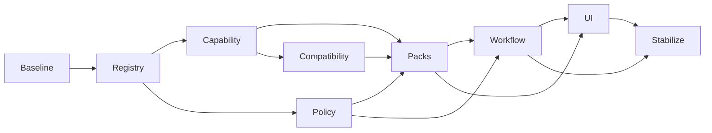

# Implementation Plan

## 1. Release plan

### v0.6: Safety and protocol

Outcomes:

- MCP 2025-11-25 alignment;
- truthful capability advertisement;
- extended ToolDef;
- structured output envelope;
- policy engine;
- signed confirmation tokens;
- generic mutation restrictions.

### v0.7: Capability and packs

Outcomes:

- capability snapshots;
- pack manifests;
- pack resolver;
- exposure profiles;
- instance-scoped mode;
- Config UI pack status.

### v0.8: Enterprise pack pilot

Outcomes:

- Manufacturing;
- Website draft subset;
- Spreadsheet/Dashboard read subset;
- POS reporting subset;
- Employee public subset.

### v0.9: Controlled commands and workflows

Outcomes:

- command tools;
- workflow runtime;
- manifests;
- dry-run;
- resume;
- domain policies.

### v1.0: Production stabilization

Outcomes:

- compatibility matrix;
- hardened tests;
- migration complete;
- observability;
- security review;
- release documentation.

## 2. Workstreams

### WS1 Protocol and Registry

- align versions;
- implement list-changed;
- add output schemas;
- add annotations;
- registry revision;
- schema validation.

### WS2 Capability

- scan service;
- snapshot store;
- feature flags;
- pack availability;
- refresh events.

### WS3 Policy and Confirmation

- declarative parser;
- decision engine;
- impact providers;
- token service;
- stale-state checks;
- audit integration.

### WS4 Compatibility

- operation keys;
- Odoo 16-19 adapters;
- method/field mapping;
- fixture matrix.

### WS5 Domain Packs

- Core;
- Manufacturing;
- Website;
- Spreadsheet/Dashboard;
- POS;
- Employee;
- baseline business packs.

### WS6 Workflow

- definitions;
- runner;
- file store;
- SQLite store;
- resume;
- compensation metadata.

### WS7 Config UI

- pack matrix;
- capability status;
- profiles;
- policies;
- workflows;
- audit.

### WS8 Testing and Documentation

- fixtures;
- CI;
- end-to-end;
- security cases;
- mdBook.

## 3. Dependency graph

## 4. Suggested Agentic Kanban epics

- EPIC-01 Protocol correctness
- EPIC-02 Registry metadata
- EPIC-03 Capability Engine
- EPIC-04 Policy Engine
- EPIC-05 Confirmation Service
- EPIC-06 Compatibility adapters
- EPIC-07 Manufacturing pack
- EPIC-08 Website pack
- EPIC-09 Spreadsheet/Dashboard pack
- EPIC-10 POS pack
- EPIC-11 Employee pack
- EPIC-12 Workflow Runtime
- EPIC-13 Config UI
- EPIC-14 Observability
- EPIC-15 Production hardening

## 5. Task requirements

Every non-trivial task must include:

- outcome;
- source-of-truth docs;
- dependencies;
- affected files;
- compatibility impact;
- security impact;
- tests;
- documentation;
- migration;
- rollback.

## 6. Blockers

Block implementation when:

- Odoo model/method compatibility is unverified;
- policy decision is unresolved;
- accounting posting behavior is unclear;
- Employee data classification is unclear;
- POS external payment semantics are unclear;
- a workflow has no idempotency or reconciliation plan;
- a command would bypass standard Odoo lifecycle.
