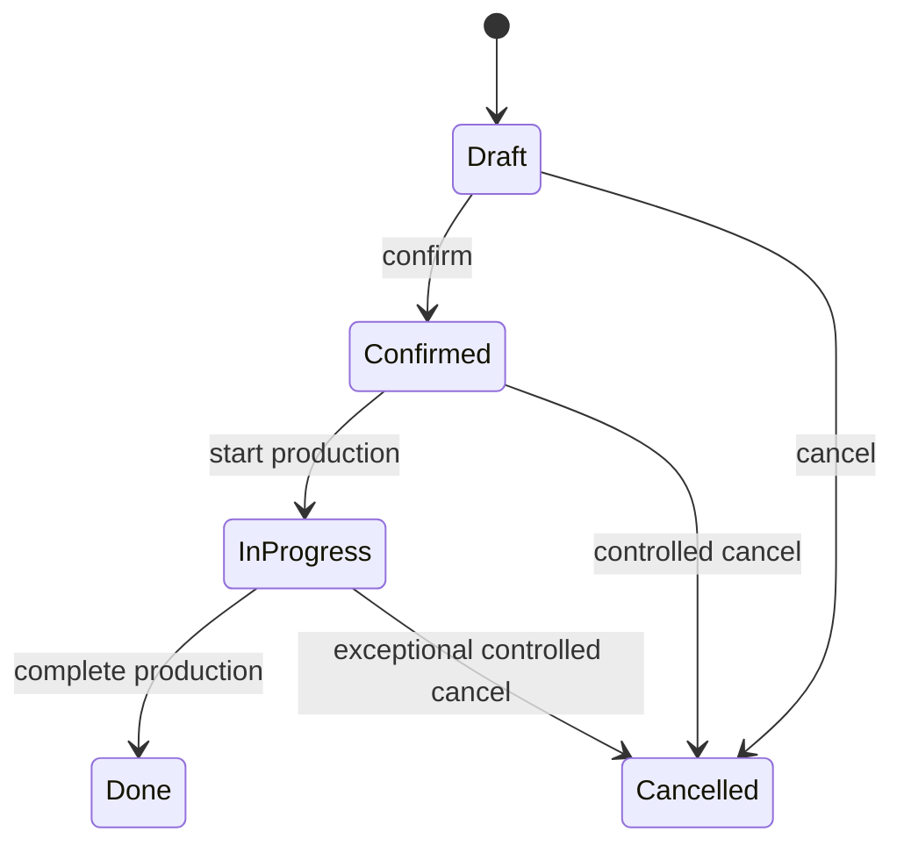

# Manufacturing Pack

## 1. Purpose

Expose planning, production execution, material availability, work-order,
traceability, and cost insights while preserving Odoo's Manufacturing and
Inventory lifecycle.

Odoo 19 Manufacturing supports production planning and processing through
manufacturing orders, bills of materials, work centers, work orders, shop-floor
operations, MPS, traceability, and optional quality or maintenance integration.
Feature availability must still be discovered per instance.

## 2. Pack boundaries

### Included

- BoM read and controlled administration;
- manufacturing orders;
- component availability;
- work orders;
- work centers;
- production quantities;
- scrap and by-products;
- lot/serial traceability;
- planning and MPS read capabilities;
- cost and variance reporting;
- deterministic release and completion workflows.

### Optional subpacks

- `manufacturing.quality`
- `manufacturing.maintenance`
- `manufacturing.subcontracting`
- `manufacturing.mps`
- `manufacturing.shop_floor`

### Excluded from base pack

- IoT device control;
- PLC or machine command execution;
- automatic accounting adjustments outside standard Odoo;
- arbitrary server actions;
- payroll or operator compensation.

## 3. Typical modules

Required:

- `mrp`

Optional, version-dependent:

- work-order or shop-floor capabilities;
- quality;
- maintenance;
- stock;
- accounting;
- subcontracting-related modules.

The Capability Engine must map marketing features to actual installed module
signatures.

## 4. Primary models

Typical models include:

- `mrp.production`
- `mrp.bom`
- `mrp.bom.line`
- `mrp.workorder`
- `mrp.workcenter`
- `mrp.workcenter.productivity`
- `stock.move`
- `stock.move.line`
- `stock.scrap`
- `stock.lot`

MPS and Enterprise-specific internal models require version adapters and runtime
discovery.

## 5. Tool catalog

### Planning and query

- `mrp_bom_search`
- `mrp_bom_get`
- `mrp_bom_explosion`
- `mrp_order_search`
- `mrp_order_get`
- `mrp_order_material_availability`
- `mrp_order_traceability`
- `mrp_order_cost_breakdown`
- `mrp_order_variance_preview`
- `mrp_workcenter_search`
- `mrp_workcenter_capacity`
- `mrp_workorder_search`
- `mrp_workorder_get`
- `mrp_mps_snapshot`
- `mrp_production_schedule_summary`

### BoM administration

- `mrp_bom_create`
- `mrp_bom_update`
- `mrp_bom_archive`
- `mrp_bom_validate`

BoM mutation is administrative and must validate:

- product;
- quantity and UoM;
- component duplicates;
- recursive BoM cycles;
- operations and work centers;
- by-products;
- company;
- effective version or date where implemented.

### Manufacturing order commands

- `mrp_order_create`
- `mrp_order_confirm`
- `mrp_order_reserve_components`
- `mrp_order_set_quantity`
- `mrp_order_record_production`
- `mrp_order_complete_preview`
- `mrp_order_complete`
- `mrp_order_cancel_preview`
- `mrp_order_cancel`

### Work-order commands

- `mrp_workorder_start`
- `mrp_workorder_pause`
- `mrp_workorder_block`
- `mrp_workorder_record_quantity`
- `mrp_workorder_finish`

### Scrap and by-products

- `mrp_scrap_preview`
- `mrp_scrap_create`
- `mrp_byproduct_summary`

### Workflows

- `mrp_release_order`
- `mrp_execute_workorder`
- `mrp_complete_order`
- `mrp_shortage_resolution_plan`
- `mrp_daily_production_snapshot`

## 6. Lifecycle

Exact states differ by version and configuration. The adapter must translate
domain states and actions.

## 7. Completion preview

Before completion, return:

- planned finished quantity;
- recorded finished quantity;
- component planned versus consumed;
- by-products;
- scrap;
- lot/serial completeness;
- remaining work orders;
- stock locations;
- expected valuation or WIP implications where available;
- quantity and cost variances;
- backorder behavior;
- warnings.

Completion is R3. Material or cost variance beyond configured thresholds
requires confirmation.

## 8. Accounting impact

Manufacturing completion can create inventory valuation effects depending on
product category, costing, valuation, and configuration. WIP handling may be
manual or feature-specific.

The pack must:

- separate operational completion from explicit WIP journal operations;
- never invent journal entries;
- report company, currency, costing method, and valuation status;
- use standard Odoo accounting behavior;
- route manual accounting work to Accounting pack.

## 9. Policies

- no direct `stock.quant` mutation;
- no production completion with missing tracked lots/serials;
- cancellation requires reason;
- scrap requires reason and confirmation over threshold;
- component substitution must be explicit;
- quantity and cost variance thresholds configurable;
- work-order finish checks dependencies;
- MPS write tools are disabled in first release;
- MPS and reordering-rule conflicts should be reported, not auto-resolved.

## 10. Idempotency

- create MO: idempotency key recommended;
- confirm: reconcile current state;
- reserve: reconcile assignment state;
- record production: non-idempotent unless line-level key exists;
- complete: reconcile state and resulting stock moves;
- scrap: idempotency key mandatory.

## 11. Acceptance tests

- BoM explosion preserves UoM;
- multi-level BoM cycle is rejected;
- insufficient stock is reported;
- tracked products require lots/serials;
- completion token becomes stale after quantity change;
- completion does not repeat after uncertain timeout;
- by-product quantities are returned;
- cross-company work center or BoM is rejected;
- WIP information is not presented as posted accounting unless verified.
