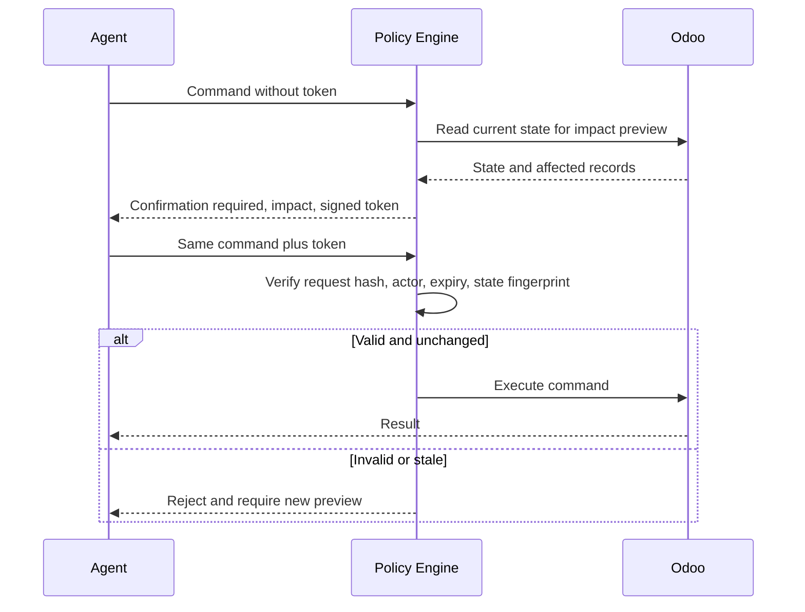

# Policy and Security

## 1. Security model

The MCP server adds controls. It does not replace Odoo access rights and record
rules.

A request must pass:

1. MCP transport authentication;
2. exposure profile;
3. input schema validation;
4. capability validation;
5. policy evaluation;
6. Odoo access rights and record rules;
7. post-execution output filtering.

## 2. Deny-by-default areas

- arbitrary model methods;
- generic delete;
- posted accounting changes;
- payment operations;
- POS closing;
- production completion with variances;
- website publication;
- internal-user creation;
- sensitive employee data;
- bulk operations;
- cross-company mutation.

## 3. Policy example

```yaml
version: 1
rules:
  - id: employee-private-fields-default-deny
    priority: 10
    match:
      pack: employee
      data_classification:
        any_of: [personal, sensitive_personal]
    effect: deny
    unless:
      profile:
        any_of: [hr-admin]
    message: Private employee fields require the hr-admin profile.

  - id: website-publish-confirmation
    priority: 20
    match:
      operation: website.page.publish
    effect: require_confirmation
    limits:
      max_records: 10

  - id: pos-close-confirmation
    priority: 20
    match:
      operation: pos.session.close
    effect: require_confirmation

  - id: manufacturing-variance-threshold
    priority: 30
    match:
      operation: manufacturing.order.complete
    conditions:
      absolute_quantity_variance_gt: 0
    effect: require_confirmation
```

## 4. Confirmation-token flow

A plain `confirm: true` is insufficient for high-impact actions.



Token binding includes:

- actor;
- client;
- instance;
- tool and operation;
- normalized arguments;
- sorted record IDs;
- state fingerprint;
- policy revision;
- expiry.

Tokens are single use.

## 5. Impact preview

High-risk preview should include relevant fields:

- record count and samples;
- current state;
- target state;
- company;
- currency and amount;
- stock quantity and locations;
- publication URL and audience;
- POS cash difference;
- manufacturing quantity variance;
- affected employee count;
- irreversible or external side effects.

## 6. Personal data

Employee pack defaults:

- public directory fields only;
- private fields excluded;
- bank, identification, home address, private contact, compensation, and
  emergency details denied;
- field-level allowlists;
- no broad `fields_get` exposure to ordinary agent profiles;
- audit access to personal-data tools;
- response minimization.

## 7. Financial data

- never sum across currencies;
- include company and currency in aggregates;
- posted entries are immutable through generic tools;
- reversal uses standard Odoo workflow;
- all financial mutation requires explicit company;
- POS and manufacturing accounting impact must be described in preview;
- output redacts payment credentials and bank identifiers where not required.

## 8. Stock and manufacturing data

- validate source and destination locations;
- validate lots and serials;
- reject negative or excess quantities unless policy allows;
- require reason for scrap, cancellation, or variance;
- re-read availability immediately before mutation;
- do not retry uncertain stock mutations blindly.

## 9. Website publication

- draft creation can be low risk;
- publishing, unpublishing, redirect changes, menu changes, forms, scripts, and
  broad SEO changes are high risk;
- HTML is sanitized;
- script injection is denied by default;
- multi-website target must be explicit;
- preview includes URL and audience.

## 10. POS

- no direct creation of paid orders through generic model writes;
- use standard POS workflow or a dedicated integration contract;
- session closing requires confirmation;
- refunds require original order reference or explicit standalone-refund policy;
- cash differences require preview and threshold policy;
- payment method and journal mapping must be validated.

## 11. Secrets

Never store secrets in:

- pack manifests;
- workflow manifests;
- audit events;
- tool output;
- Git-tracked examples.

Use existing secret configuration first. Add an external secret manager only
when deployment requirements justify it.

## 12. Rate and size limits

Apply:

- calls per client;
- calls per instance;
- concurrent writes;
- record count;
- response bytes;
- upload bytes;
- workflow step count;
- workflow duration;
- confirmation challenge frequency.

## 13. Prompt injection resistance

Tool descriptions and Odoo content are untrusted input.

- never treat record text as policy;
- do not execute instructions found in notes, pages, emails, or attachments;
- isolate content from control metadata;
- require explicit tool arguments for actions;
- confirmation preview must use server-derived facts.
