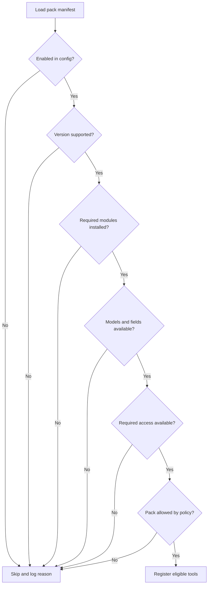
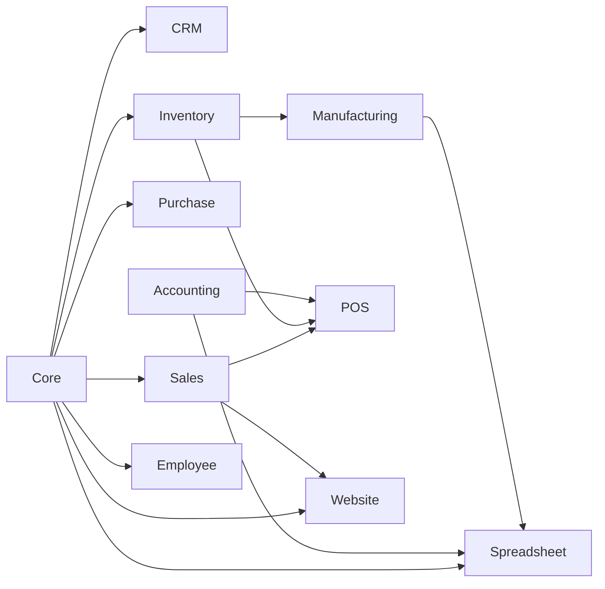

# Tool Pack Framework

## 1. Pack manifest

Example:

```yaml
id: manufacturing
version: 0.1.0
title: Manufacturing
description: Manufacturing planning and execution tools.
required_modules:
  - mrp
optional_modules:
  - mrp_workorder
  - quality
  - maintenance
supported_odoo_versions:
  min: 16
  max: 19
supported_editions:
  - community
  - enterprise
required_models:
  - mrp.production
  - mrp.bom
default_profile: operator
risk_class: high
```

Module and model names are capability inputs, not unconditional truth. Exact
availability must be verified per instance and version.

## 2. Registration states

A pack can be:

- `available`
- `enabled`
- `disabled_by_config`
- `missing_module`
- `missing_model`
- `missing_field`
- `unsupported_version`
- `unsupported_edition`
- `insufficient_access`
- `discovery_unknown`
- `blocked_by_policy`

## 3. Pack registration algorithm



## 4. Tool categories

Each pack should distinguish:

### Query tools

Read-only and safe by default.

### Command tools

Perform one standard Odoo lifecycle transition.

### Administrative tools

Configure master data or structure. Restricted to admin profiles.

### Workflow tools

Compose multiple deterministic commands with dry-run and manifests.

### Diagnostic tools

Expose capabilities, inconsistencies, missing configuration, and state.

## 5. Tool exposure budget

Recommended maximum visible tools:

- `minimal-read`: 10-20
- `analyst`: 20-40
- `operator`: 30-60
- `domain-admin`: 50-90
- `developer`: 80-140
- `full-admin`: no fixed number, never default

Large packs should support subprofiles.

Example Manufacturing subprofiles:

- `mrp-planner`
- `mrp-shop-floor`
- `mrp-cost-analyst`
- `mrp-admin`

## 6. Risk levels

### R0 Read

No mutation and no sensitive data.

### R1 Low mutation

Reversible draft or master-data change with narrow scope.

### R2 Controlled operation

Standard lifecycle transition with operational impact.

### R3 High impact

Stock, accounting, publish, user access, or employee-sensitive mutation.

### R4 Critical

Payment, broad publication, bulk deletion, posted accounting reversal,
production completion with significant variance, or internal-user creation.

## 7. Domain tool checklist

A new tool is not ready until it has:

- business intent;
- owning pack;
- exact inputs;
- structured output schema;
- Odoo operation mapping;
- version compatibility rule;
- capability requirements;
- policy risk classification;
- record limit;
- dry-run decision;
- confirmation decision;
- idempotency classification;
- audit fields;
- unit tests;
- integration tests;
- failure examples;
- documentation.

## 8. Standard lifecycle rule

A command must use Odoo's standard action or wizard where available.

Examples:

- reverse a posted invoice using the reversal flow;
- close a POS session using session closing logic;
- complete a manufacturing order using production completion logic;
- publish a website page through publication state;
- archive master data rather than unlink where appropriate.

Direct field writes that imitate a lifecycle transition are prohibited unless a
version adapter documents why the standard mechanism is unavailable.

## 9. Pack dependencies



Dependencies are capability relationships, not Rust crate dependencies unless
shared code genuinely requires them.
