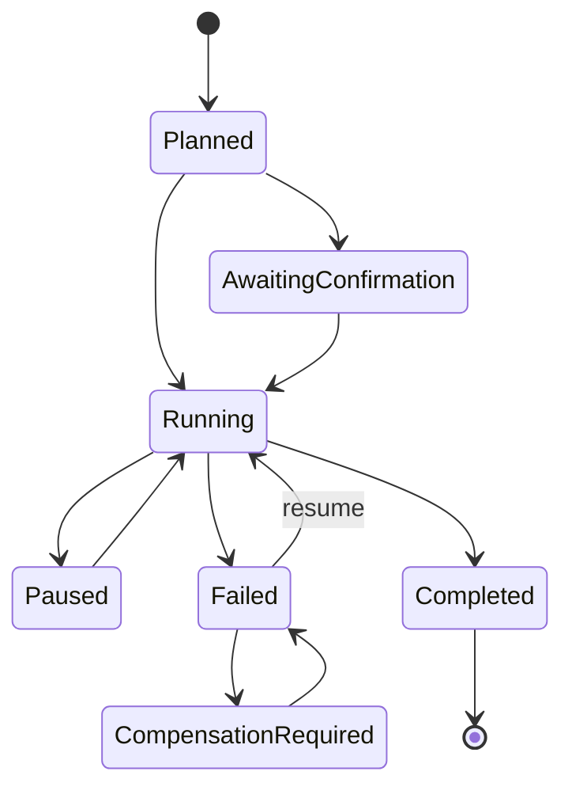

# Workflow Runtime

## 1. Purpose

Compose multiple deterministic domain operations into recoverable workflows.

The runtime does not contain an LLM. The calling agent selects a workflow and
provides inputs. The runtime validates and executes declared steps.

## 2. Workflow definition

```yaml
id: manufacturing.release_order
version: 1
pack: manufacturing
supports_dry_run: true
supports_resume: true
idempotency_scope: instance
steps:
  - id: load
    operation: manufacturing.order.read
  - id: validate_materials
    operation: manufacturing.materials.check
  - id: confirm
    operation: manufacturing.order.confirm
  - id: reserve
    operation: manufacturing.order.reserve
```

## 3. Step types

- `read`
- `validate`
- `command`
- `wait`
- `human_checkpoint`
- `compensation`
- `emit`

Avoid arbitrary scripting in workflow definitions.

## 4. Execution states



## 5. Manifest example

```json
{
  "run_id": "run_01J...",
  "workflow": "manufacturing.release_order",
  "workflow_version": 1,
  "instance": "production",
  "input_hash": "sha256:...",
  "idempotency_key": "mo:WH/MO/00125:release",
  "status": "failed",
  "steps": [
    {
      "id": "load",
      "status": "completed",
      "result_ref": "artifact:step-load"
    },
    {
      "id": "validate_materials",
      "status": "completed"
    },
    {
      "id": "confirm",
      "status": "completed",
      "odoo_record": {
        "model": "mrp.production",
        "id": 125
      }
    },
    {
      "id": "reserve",
      "status": "failed",
      "error_code": "ODOO_VALIDATION_INSUFFICIENT_STOCK"
    }
  ]
}
```

## 6. Dry-run

Dry-run returns:

- ordered step plan;
- intended operations;
- required capabilities;
- required confirmations;
- estimated affected records;
- policy warnings;
- unsupported or uncertain steps.

Dry-run must perform no mutation.

## 7. Idempotency

Operations are classified:

- naturally idempotent;
- idempotent with key;
- reconcilable;
- non-idempotent.

A retry must not repeat a non-idempotent step without outcome reconciliation.

Example:

- reading an MO: naturally idempotent;
- creating a draft page: idempotent with external key;
- confirming an MO: reconcilable by checking state;
- charging a payment: non-idempotent unless provider key guarantees it.

## 8. Resume

Before resuming:

1. load manifest;
2. confirm workflow version compatibility;
3. read current Odoo state;
4. verify completed-step postconditions;
5. mark drift;
6. continue only from safe boundary.

## 9. Compensation

Compensation is explicit and domain-specific.

Examples:

- archive a newly created draft;
- cancel an unposted draft document;
- restore a previous website draft revision;
- create a reversal request.

Never implement generic rollback by deleting records.

## 10. Storage

### File store

Suitable for MVP and single process:

- atomic rename;
- one file per run;
- lock per run;
- append-only event journal;
- startup recovery scan.

### SQLite store

Recommended for Production Standard:

- WAL;
- explicit migrations;
- unique idempotency constraints;
- retention;
- indexed status lookup.

## 11. Candidate workflows

- `sales.quote_to_order`
- `purchase.vendor_bill_intake`
- `manufacturing.release_order`
- `manufacturing.complete_order`
- `website.publish_page`
- `dashboard.build_snapshot`
- `pos.close_session`
- `employee.onboarding_plan`

Workflows must use tools from domain packs rather than bypassing them.
