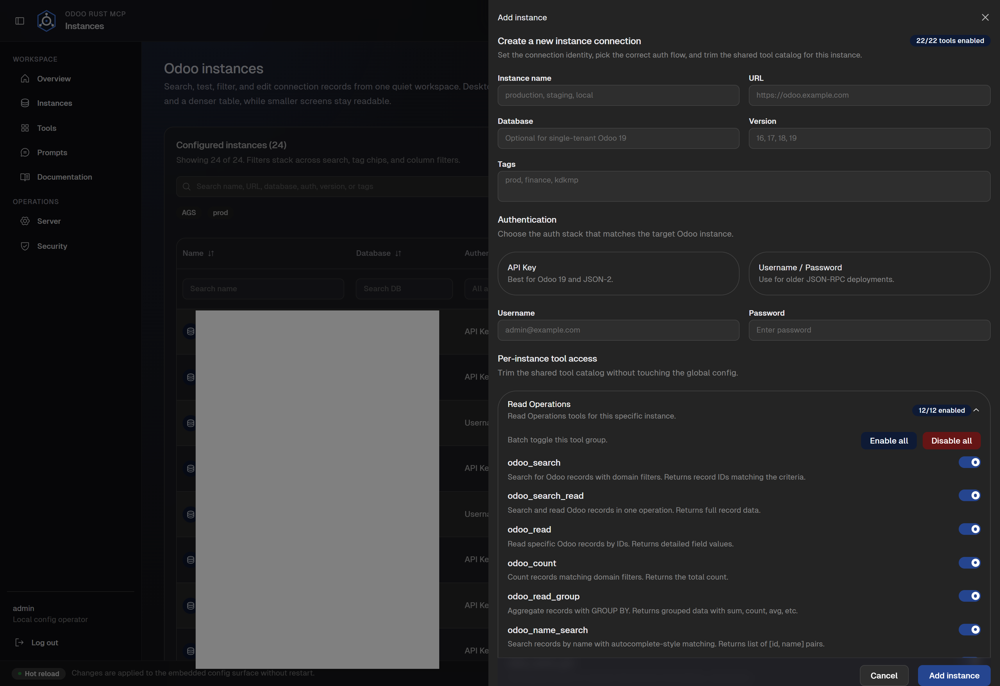
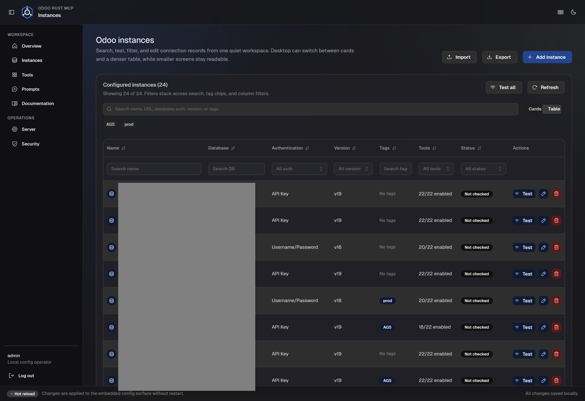

# Odoo Rust MCP

Odoo MCP server with a built-in Config UI for managing instances, tools, prompts, server metadata, and security from one place.

Supports:

- Odoo `19+` via JSON-2 + API key
- Odoo `18-` via JSON-RPC + username/password
- MCP over `stdio`, `http`, and `ws`
- Config UI on `http://localhost:3008`

Current version: `0.6.0`

## Screenshots

| Overview | Instances |
| --- | --- |
|  |  |
|  |  |

| Tools | Prompts |
| --- | --- |
|  |  |

| Server | Security |
| --- | --- |
|  |  |

## Install on Windows

Choose one of the following installation methods:

### Option A: Tauri Desktop Application (Recommended)

1. Download the latest setup installer (`Odoo.Rust.MCP_0.6.0_x64-setup.exe` or `.msi`) from [GitHub Releases](https://github.com/milzamsz/odoo-rust-mcp/releases).
2. Run the installer to install the premium desktop application shell.
3. Launch **Odoo Rust MCP** from your Start menu or Desktop shortcut.

*Features of the Desktop App:*
- Runs the Odoo Rust MCP server as a background sidecar.
- Opens the Config UI in a dedicated, high-performance webview container.
- Integrates a built-in auto-updater with cryptographic signature verification.
- Intercepts documentation links to open them safely in your system default browser.

### Option B: Advanced CLI / Windows Service

1. Download the latest `odoo-rust-mcp-windows.zip` from [GitHub Releases](https://github.com/milzamsz/odoo-rust-mcp/releases).
2. Extract it to a permanent folder (e.g., `C:\Workspace\mcp\odoo-rust-mcp`).
3. Open PowerShell as Administrator in that folder and run:
   ```powershell
   Set-ExecutionPolicy -Scope Process Bypass
   .\install.ps1
   ```

*What the script installer does:*
- Copies `odoo-rust-mcp.exe` to `C:\Program Files\odoo-rust-mcp`.
- Initializes configurations in `C:\ProgramData\odoo-rust-mcp`.
- Registers a desktop shortcut `Odoo MCP Server.lnk`.
- (Optional) Appending `-Service` installs the backend server as a persistent Windows Service.

To start, double-click `Odoo MCP Server.lnk`. It will bootstrap the server and open the Config UI in your default browser at `http://localhost:3008`.

If the web UI does not open, check the logs under `.codex-run/`.

## First Login

Default Config UI credentials:

```text
username: admin
password: changeme
```

After logging in:
1. Open the **Security** tab.
2. Change the Config UI password.
3. If using HTTP transport, generate your secure MCP Bearer token.
4. On the **Overview** tab, you can click **Sync to env** to immediately export and back up your instances configuration into the local `.env` configuration.

## Add Your Odoo Instance

Open `Instances`, then click `Add instance`.

Use:
- `API Key` for Odoo `19+` (using modern JSON-2 flow)
- `Username / Password` for Odoo `18-` (using JSON-RPC flow)

Typical fields:
- `Name`: internal label used in MCP calls
- `URL`: your Odoo base URL
- `Database`: required for older Odoo and some multi-db setups
- `Version`: `16`, `17`, `18`, or `19`
- `Tags`: optional labels for filtering in the UI

Then click `Test` to verify the connection.

Use **Documentation** in the sidebar to open the bundled mdBook guide, or read it online at: **[https://milzamsz.github.io/odoo-rust-mcp/](https://milzamsz.github.io/odoo-rust-mcp/)**.


## AI Install Prompt

Paste this into ChatGPT, Codex, or Claude if you want AI to walk the install with you:

```text
Help me install Odoo Rust MCP on Windows from the latest GitHub release.

Use PowerShell commands only.
Assume I want the Config UI shortcut working.
Run this flow:
1. Verify PowerShell version and whether I am Administrator.
2. Download the latest Windows release ZIP.
3. Extract it to a persistent folder.
4. Run install.ps1 as Administrator.
5. Confirm C:\Program Files\odoo-rust-mcp\odoo-rust-mcp.exe exists.
6. Confirm the desktop shortcut Odoo MCP Server.lnk exists.
7. Launch the shortcut.
8. Verify http://localhost:3008 opens.
9. Tell me exactly where to login and add my first Odoo instance.

If something fails, show the next PowerShell command to run and explain the error briefly.
```

## MCP Client Setup

Use the Config UI first. It is the fastest way to get your instances, tools, prompts, and auth correct.

Then connect your client:

- Cursor: [docs/src/functional/configuration.md](docs/src/functional/configuration.md)
- Claude Desktop: [docs/src/functional/configuration.md](docs/src/functional/configuration.md)
- ChatGPT Desktop / Codex: [docs/src/functional/configuration.md](docs/src/functional/configuration.md)

## Other Install Paths

If you are not installing on Windows:

- APT: [docs/src/functional/getting-started.md](docs/src/functional/getting-started.md)
- Docker, Helm, Kubernetes: [docs/src/functional/deployment.md](docs/src/functional/deployment.md)

## Developer Notes

Repo operators should start with:

- [AGENTS.md](AGENTS.md)
- [TECHNICAL.md](TECHNICAL.md)
- [docs/src/developer/building.md](docs/src/developer/building.md)

Quick local loop:

```powershell
cargo test --all-features --manifest-path rust-mcp/Cargo.toml
cd config-ui
npm run lint
npm run typecheck
npm test -- --run
npm run build
```

## License

`AGPL-3.0`
