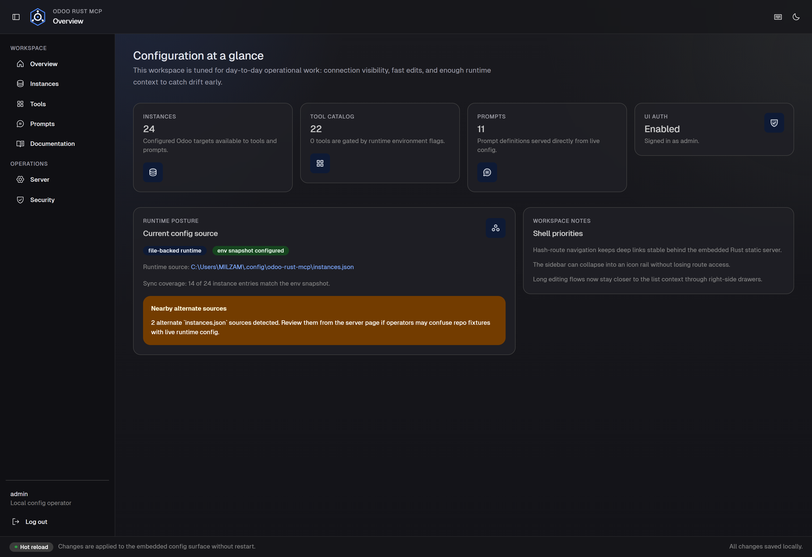

# Introduction

## What is the Model Context Protocol (MCP)?

The [Model Context Protocol](https://modelcontextprotocol.io/) is an open standard that lets AI
assistants interact with external tools and data sources through one shared interface.

## What is odoo-rust-mcp?

**odoo-rust-mcp** is a Rust MCP server that connects AI assistants to [Odoo ERP](https://www.odoo.com/).
It translates AI requests into Odoo API calls so you can query, create, update, and manage Odoo
data through conversational tooling.

### Key Capabilities

- **22 tools** covering CRUD, workflow actions, reports, model discovery, and cleanup
- **11 built-in prompts** covering Odoo data operations plus Owl and frontend guidance
- **Multi-instance support** for production, staging, and local environments
- **Dual authentication** for Odoo 19+ JSON-2 and Odoo 18 and earlier JSON-RPC
- **Multiple transports** including stdio, HTTP, WebSocket, and SSE compatibility
- **Built-in Config UI** on port 3008
- **Hot reload** for config, tool, prompt, and instance updates

### Who Is This For?

| Audience | Use Case |
|----------|----------|
| **Odoo users and IT admins** | Query data, generate reports, and automate workflows through AI assistants |
| **Developers** | Build AI-powered Odoo integrations and extend the server |
| **DevOps engineers** | Deploy and operate the MCP server in production |

### Technical Details

- **Language**: Rust
- **License**: AGPL-3.0
- **Version**: 0.5.0
- **Repository**: [github.com/milzamsz/odoo-rust-mcp](https://github.com/milzamsz/odoo-rust-mcp)

---

## Config UI at a Glance

The built-in web UI runs at `http://localhost:3008`.

| Area | Purpose |
|------|---------|
| **Overview** | Runtime summary, auth posture, and config-source checks |
| **Instances** | Add, edit, test, import, and export Odoo connections |
| **Tools** | Enable or disable tool groups and individual tools |
| **Prompts** | Manage built-in and custom prompts |
| **Server** | Edit server name, instructions, and protocol version |
| **Security** | Change Config UI password and manage MCP HTTP auth |
| **Documentation** | Open the built-in docs in a separate tab from the sidebar |

*The current Config UI shell with the expanded sidebar and the built-in documentation shortcut.*

The sidebar is **collapsible**, adapts to smaller screens, and now includes a direct route to the
documentation.

---

## Documentation Structure

This documentation is organized into two sections:

### Functional Documentation

- [Getting Started](./functional/getting-started.md)
- [Configuration](./functional/configuration.md)
- [Config UI Guide](./functional/config-ui.md)
- [Tools Reference](./functional/tools-reference.md)
- [Prompts Reference](./functional/prompts-reference.md)
- [Use Cases](./functional/use-cases.md)
- [Deployment](./functional/deployment.md)

### Developer Documentation

- [Building from Source](./developer/building.md)
- [Architecture](./developer/architecture.md)
- [API Reference](./developer/api-reference.md)
- [Testing](./developer/testing.md)
- [Contributing](./developer/contributing.md)
