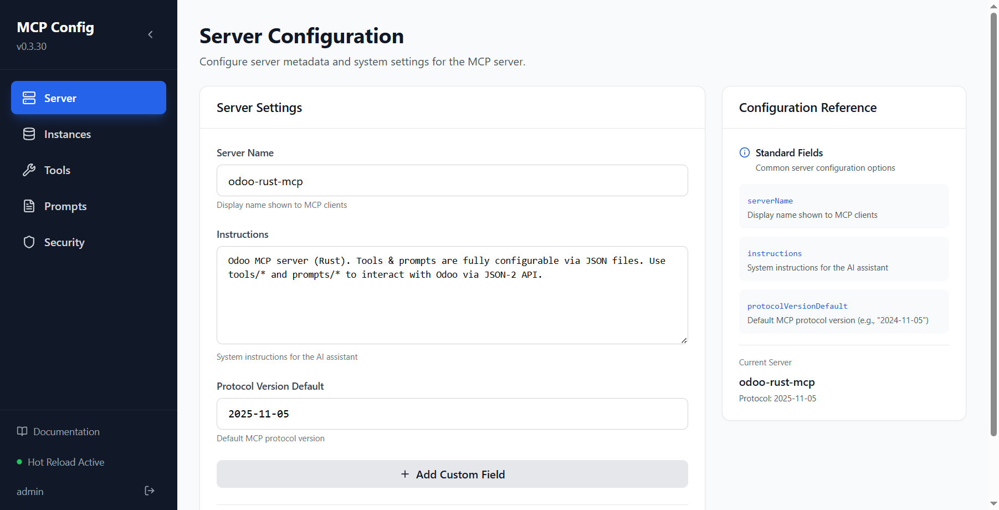
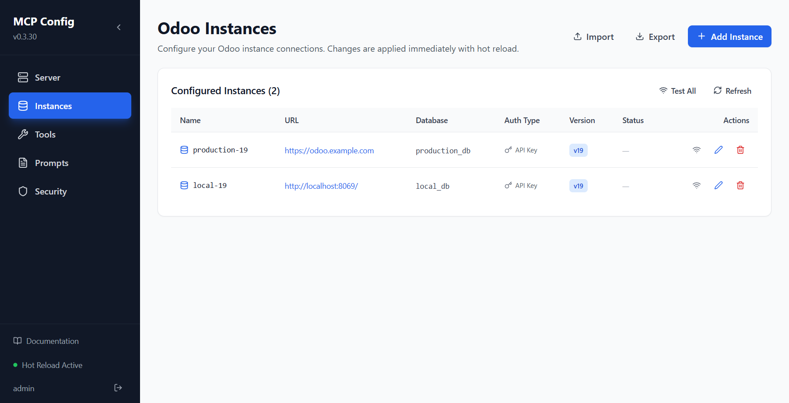
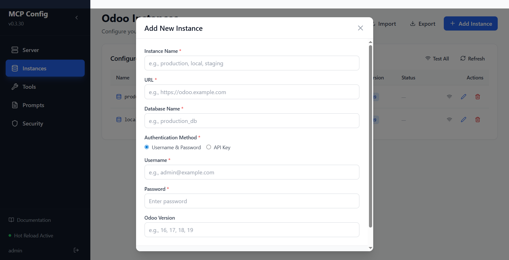
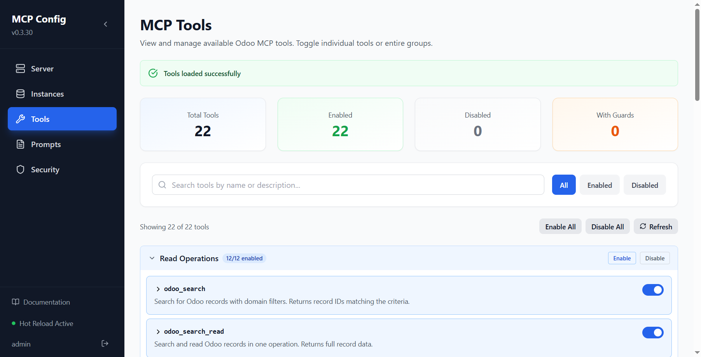
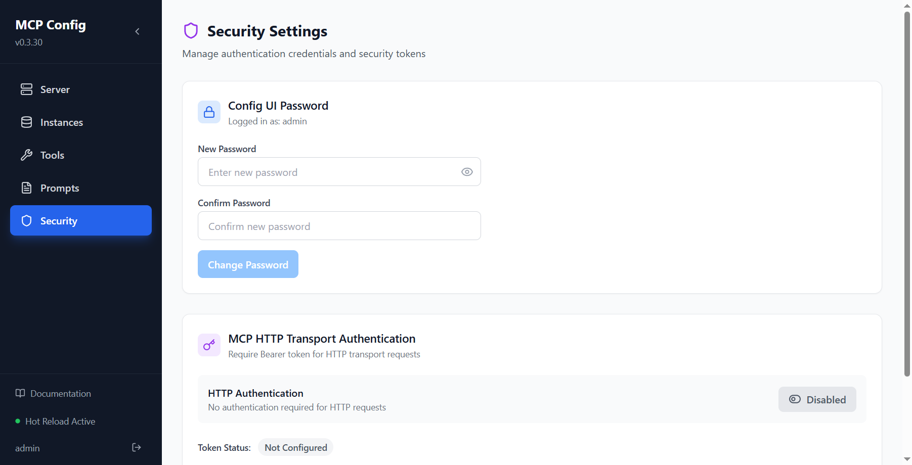

# Config UI Guide

The Config UI is a built-in web interface that lets you manage every aspect of the MCP server without editing JSON files by hand. It runs on **port 3008** alongside the main MCP server.

**URL:** `http://localhost:3008`

---

## Accessing the Config UI

Open a browser and navigate to `http://localhost:3008`. If authentication is enabled (recommended), you will be prompted to log in.

### Default credentials

Set via environment variables (see [Configuration](./configuration.md#config-ui-authentication)):

```
CONFIG_UI_USERNAME=admin
CONFIG_UI_PASSWORD=changeme
```

> **Important:** Change the default password immediately after first install using the **Security** tab.


*The default login page before you enter the credentials configured for the Config UI.*

---

## Sidebar Navigation

The left sidebar provides navigation to all tabs. It is **collapsible** to save screen space:

| State | Behavior |
|-------|----------|
| **Expanded** | Full width (256 px) — shows icon + label for each nav item |
| **Collapsed** | Narrow strip (64 px) — shows icons only; labels appear as tooltips |

- Click the **‹** / **›** arrow button at the top of the sidebar to toggle manually.
- On screens narrower than **768 px** the sidebar auto-collapses.
- Your preference is saved in `localStorage` and restored on the next visit.

### Sidebar footer

The sidebar footer always shows:

| Item | Description |
|------|-------------|
| 📖 **Documentation** | Opens this documentation at `/docs/` in a new tab |
| ● **Hot Reload Active** | Green dot — confirms configuration changes apply instantly |
| **Username + Logout** | Shown when authentication is enabled |



*A logged-in overview of the Config UI with the expanded sidebar, server settings, and documentation link visible.*

---

## Tabs Overview

### Server Tab

Edit the MCP server identity and system prompt that AI clients receive.

| Field | Description |
|-------|-------------|
| **Server Name** | Name advertised to MCP clients (e.g., `odoo-rust-mcp`) |
| **Instructions** | Agent-oriented system instructions sent to AI clients — covers how to work safely and when to fetch deeper prompt references |
| **Protocol Version** | MCP protocol version string |

Changes are saved and hot-reloaded immediately — no server restart required.

---

### Instances Tab

Manage Odoo server connections. This is the most commonly used tab.

#### Instance list

Each configured instance is displayed as a searchable card. Use the search field to filter by name, URL, database, auth mode, version, or manual tags.

| Column | Description |
|--------|-------------|
| **Name** | Unique identifier used in tool calls (`instance` parameter) |
| **URL** | Odoo server URL (clickable link) |
| **Database** | Database name |
| **Auth Type** | `API Key` (Odoo 19+) or `Username/Password` (Odoo <19) |
| **Version** | Odoo version badge if specified |
| **Tags** | Optional manual labels such as `prod`, `staging`, or `finance` |
| **Status** | Connection test result (idle / checking / ✓ Xms / ✗ error) |
| **Actions** | Test, Edit, Delete |



*The Instances tab with example values redacted before capture so the screenshot stays realistic without exposing live instance details.*

#### Adding / editing an instance

Click **Add Instance** or the ✏ (edit) icon to open the instance form. Fields:

| Field | Required | Notes |
|-------|----------|-------|
| `url` | Yes | e.g. `https://myodoo.com` |
| `db` | v<19 | Required for JSON-RPC auth |
| `apiKey` | v19+ | Bearer token from Odoo Settings → API Keys |
| `version` | v<19 | e.g. `18` — triggers username/password mode |
| `username` | v<19 | Odoo login username |
| `password` | v<19 | Odoo login password |
| `protocol` | No | `auto` (default), `jsonrpc`, or `json2` |
| `tags` | No | Manual labels used to search and filter Odoo Instances |
| `timeout_ms` | No | Request timeout; default `30000` ms |
| `max_retries` | No | Retry attempts; default `2` |



*The add-instance form used for both new connections and edits to existing entries.*

#### Testing connections

- **Per-row test** — click the wifi icon (⊘) on any instance row. Shows latency in ms on success or error message on failure.
- **Test All** — button in the card header runs all tests in parallel.

Connection tests run server-side (Rust → Odoo), so they bypass browser CORS restrictions.

#### Bidirectional instance sync

The running MCP tool pool stays in sync with the Config UI:

- **Config UI → MCP pool**: When you save an instance, the live `OdooClientPool` reloads automatically. Tool calls immediately use the updated credentials — no restart needed.
- **Env vars → Config UI**: On startup, instances defined via the `ODOO_INSTANCES` environment variable (that are not already in `instances.json`) are merged into the file, so they appear in the UI.

#### Export instances

Click **Export** to download the full `instances.json` as a file named `odoo-instances-YYYY-MM-DD.json`. Useful for backups or moving config between environments.

#### Import instances

Click **Import** and select a JSON file (previously exported or hand-crafted). A confirmation dialog shows:

| Section | Description |
|---------|-------------|
| **New instances** (green) | Instances in the file that don't yet exist locally |
| **Conflicts** (amber) | Instances whose names match existing ones |
| **Import mode** | Choose **Merge** or **Replace all** |

**Merge** (default) — adds new instances and overwrites conflicting ones; all other existing instances are kept.

**Replace all** — removes all current instances and uses only the imported file. The confirm button turns red as a visual warning.

---

### Tools Tab

Enable or disable individual MCP tools. Disabled tools are hidden from AI clients entirely.

#### Group-based control

Tools are organized into three operation groups:

| Group | Color | Env Gate | Tools |
|-------|-------|----------|-------|
| **Read Operations** | Blue | None (always available) | `odoo_search`, `odoo_search_read`, `odoo_read`, `odoo_count`, `odoo_read_group`, `odoo_name_search`, `odoo_name_get`, `odoo_default_get`, `odoo_list_models`, `odoo_get_model_metadata`, `odoo_check_access`, `odoo_generate_report`, `odoo_onchange` |
| **Write Operations** | Yellow | `ODOO_ENABLE_WRITE_TOOLS=true` | `odoo_create`, `odoo_create_batch`, `odoo_update`, `odoo_delete`, `odoo_copy`, `odoo_execute`, `odoo_workflow_action` |
| **Cleanup Operations** | Red | `ODOO_ENABLE_CLEANUP_TOOLS=true` | `odoo_database_cleanup`, `odoo_deep_cleanup` |

Each group header shows a badge **X / Y enabled** and has **Enable All** / **Disable All** buttons for that group.

Tools not in any defined group appear under an **Other** section.

> **Note:** Cleanup tools also require the `ODOO_ENABLE_CLEANUP_TOOLS` environment variable to be `true` — the UI toggle alone is not sufficient.



*The Tools tab groups operations into read, write, and cleanup sections with bulk enable and disable controls.*

#### Individual tool control

Expand a group (click the header) to see individual tools with their toggle switches, descriptions, and operation type badges.

---

### Prompts Tab

Manage MCP prompts — canned context snippets that AI clients can request by name.

The built-in prompts cover:

| Prompt | Topic |
|--------|-------|
| `odoo_common_models` | List of commonly used Odoo models |
| `odoo_domain_filters` | Domain filter syntax guide |
| `odoo_field_types` | Field types and relational field patterns |
| `odoo_workflow_states` | Common workflow states for Odoo documents |
| `odoo_read_group` | Aggregation and reporting with `read_group` |
| `odoo_context` | Odoo context parameters |
| `odoo_api_tips` | Best practices for Odoo API usage |
| `odoo_owl_components` | Owl component structure and first-pass debugging checks |
| `odoo_assets_and_bundles` | Asset bundle selection and module wiring |
| `odoo_frontend_contexts` | Choosing backend, client action, standalone Owl, or website runtime |
| `odoo_qweb_and_templates` | QWeb/Owl template rules and version-sensitive XML guidance |

You can add custom prompts or edit existing ones directly in the JSON editor.

---

### Security Tab

Manage authentication for both the Config UI and the MCP HTTP transport.



*The Security tab covers Config UI password changes and MCP HTTP authentication token management.*

#### Config UI password

Change the password for the web interface. Requires your current session (you must already be logged in).

#### MCP HTTP auth

When running in HTTP transport mode, you can require AI clients to present a bearer token:

1. **Enable MCP Auth** — toggle the `MCP_AUTH_ENABLED` setting.
2. **Generate Token** — creates a new random token and writes it to the env file.
3. Copy the token to your AI client's MCP configuration.

The token is written to `~/.config/odoo-rust-mcp/env` and hot-reloaded immediately.

---

## Hot-Reload Behavior

All changes through the Config UI are applied **instantly** without restarting the server:

| Change | Effect |
|--------|--------|
| Save instances | `OdooClientPool` reloads; cached clients cleared |
| Save tools / prompts | Registry reloads; AI clients see new tool list on next `tools/list` |
| Save server config | Server name and instructions updated |
| Change password | Auth config reloads in memory |
| Toggle MCP auth | HTTP transport reloads auth settings |

---

## Keyboard Shortcuts

| Action | Shortcut |
|--------|----------|
| Toggle sidebar | Click **‹ / ›** button |
| Submit form | `Enter` (in most text inputs) |
| Cancel form | `Escape` |

---

## Accessing the Documentation

The built-in mdBook documentation is served at `http://localhost:3008/docs/` when the docs have been built.

To build the docs:

```bash
cd docs
mdbook build
```

Once built, the **📖 Documentation** link in the sidebar footer opens the docs directly.
