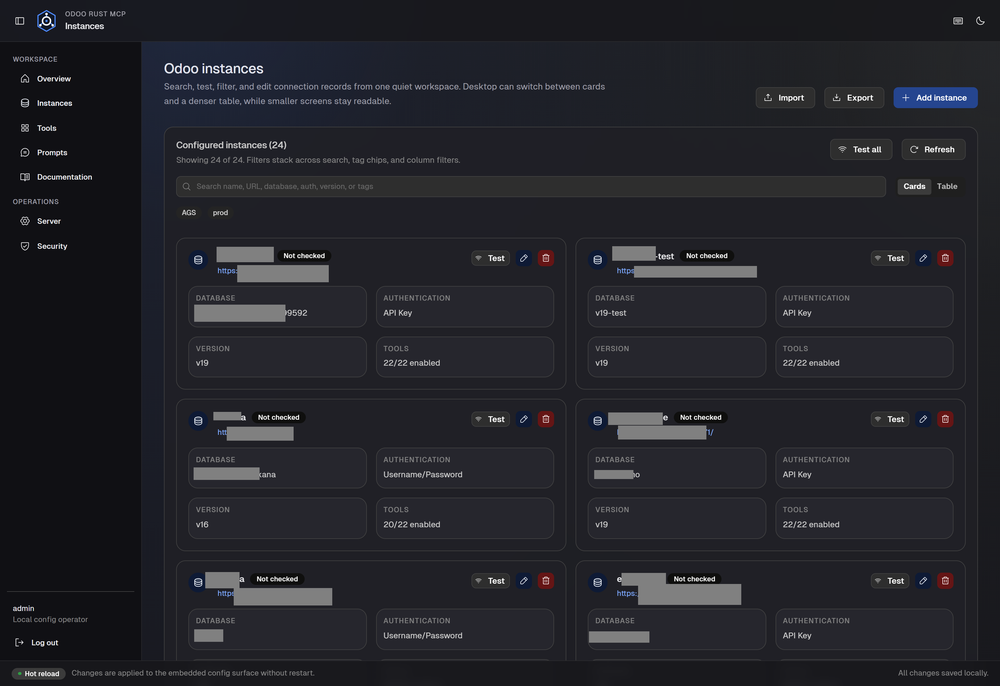
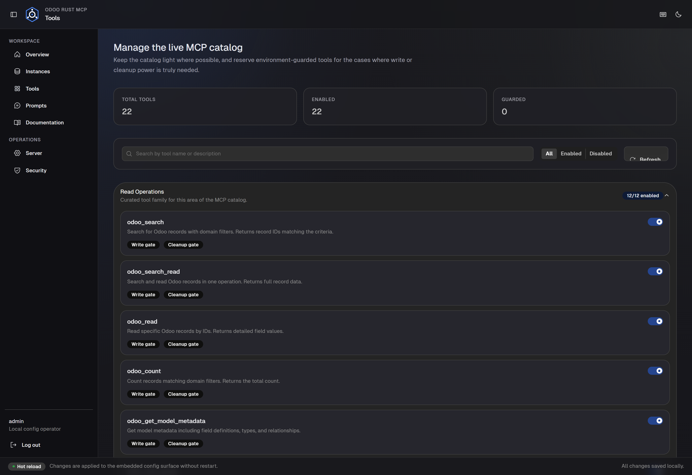
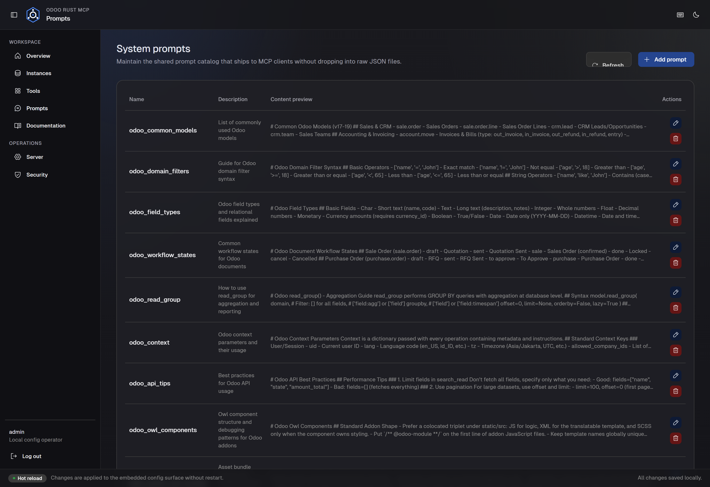
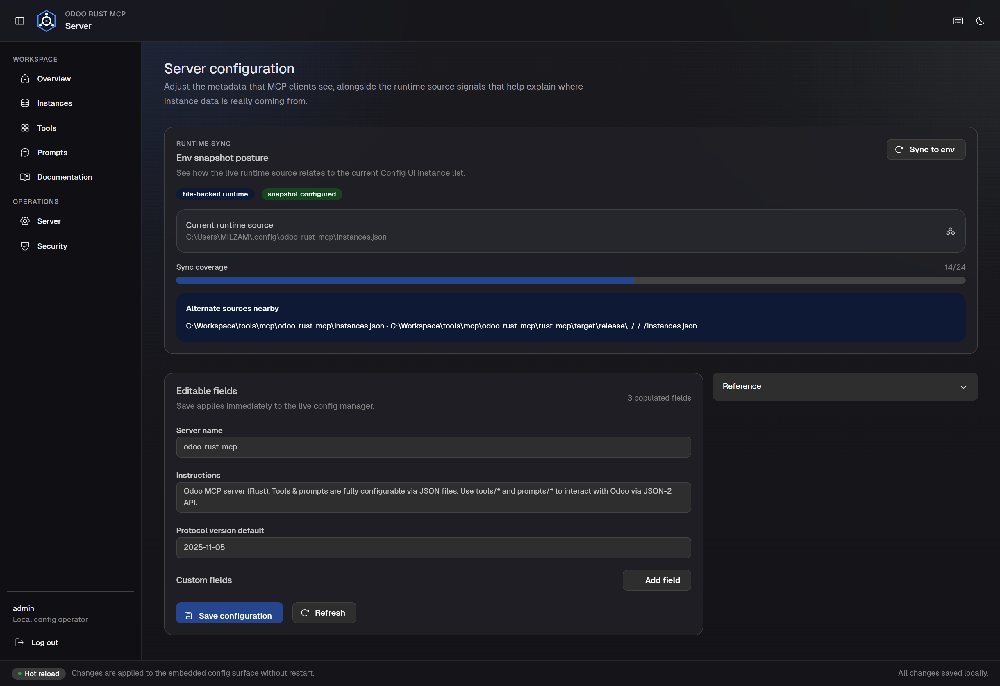
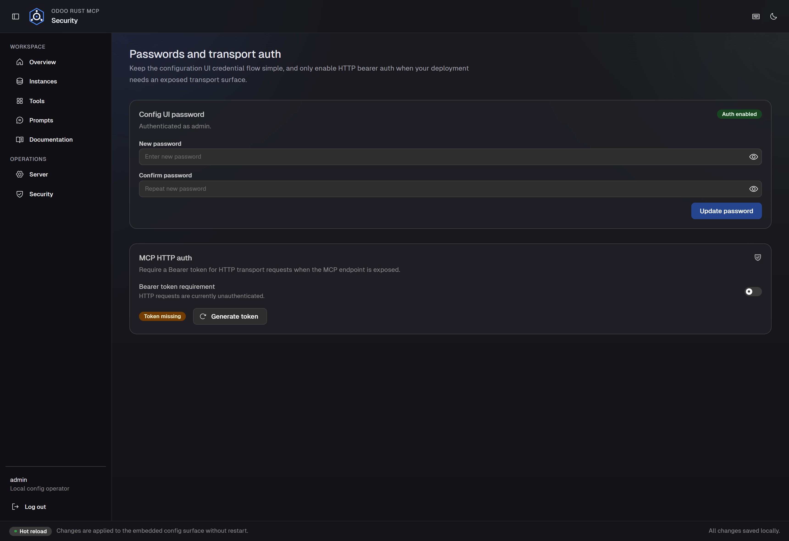

# Config UI Guide

The Config UI is the built-in control surface for `odoo-rust-mcp`. It lets you manage instances,
tools, prompts, server metadata, and security settings without editing JSON by hand. It runs on
**port 3008** alongside the main MCP server.

**URL:** `http://localhost:3008`

---

## Accessing the Config UI

Open a browser and navigate to `http://localhost:3008`.

### Default credentials

Set via environment variables (see [Configuration](./configuration.md#config-ui)):

```text
CONFIG_UI_USERNAME=admin
CONFIG_UI_PASSWORD=changeme
```

> **Important:** Change the default password immediately after first install using the
> **Security** tab.

---

## Sidebar Navigation

The left sidebar is the main workspace navigator. It is **collapsible** to save space.

| State | Behavior |
|-------|----------|
| **Expanded** | Full width (about 244 px) and shows icon + label for each entry |
| **Collapsed** | Narrow icon rail (about 64 px) with tooltips on hover |

- Click the sidebar toggle button in the top header to collapse or expand it.
- On screens narrower than **768 px** the sidebar becomes a mobile drawer.
- Your preference is saved in `localStorage` and restored on the next visit.

Current sidebar entries:

| Section | Entry | Purpose |
|---------|-------|---------|
| Workspace | **Overview** | Runtime summary and quick posture checks |
| Workspace | **Instances** | Odoo connection records |
| Workspace | **Tools** | MCP catalog toggles |
| Workspace | **Prompts** | Shared prompt definitions |
| Workspace | **Documentation** | Opens `/docs/` in a new tab |
| Operations | **Server** | Server metadata and runtime source signals |
| Operations | **Security** | UI password and MCP HTTP auth |

### Header and footer

The header stays intentionally quiet and focuses on:

| Item | Description |
|------|-------------|
| **Route title** | The current workspace section |
| **Sidebar toggle** | Collapse or expand the desktop sidebar |
| **Keyboard help** | Opens the shortcut reference |
| **Theme mode** | Chooses `Light`, `Dark`, or `Auto` (follow system theme) |

The footer shows:

| Item | Description |
|------|-------------|
| **Hot Reload** | Confirms configuration changes apply instantly |
| **Unsaved state** | Warns when edits are still pending |


*The current dark-mode overview with the collapsible sidebar and the `Documentation` entry in the
workspace navigation.*

---

## Tabs Overview

### Overview Tab

The authenticated landing route is **Overview**. It highlights:

- configured instance count
- tool catalog count
- prompt count
- UI auth posture
- runtime source and env snapshot posture

Use this page when you want to quickly confirm whether the running server is reading the config you
expect.

### Instances Tab

Manage Odoo server connections. This is the most commonly used tab.

#### Instance list

Each configured instance can be viewed as cards or in a denser table. Use the primary search field
to filter by name, URL, database, auth mode, version, or manual tags.

| Field | Description |
|-------|-------------|
| **Name** | Unique identifier used in tool calls (`instance`) |
| **URL** | Odoo server URL |
| **Database** | Database name |
| **Authentication** | `API Key` (Odoo 19+) or `Username/Password` (Odoo 18 and earlier) |
| **Version** | Odoo version badge when specified |
| **Tags** | Optional manual labels such as `prod`, `staging`, or `finance` |
| **Status** | Connection test result |
| **Actions** | Test, Edit, Delete |



*The current instances workspace supports both card and table views, with public screenshots
redacted before capture.*

#### Adding and editing an instance

Click **Add Instance** or an edit action to open the right-side drawer.

| Field | Required | Notes |
|-------|----------|-------|
| `url` | Yes | Example: `https://myodoo.com` |
| `db` | Odoo 18 and earlier | Required for JSON-RPC auth |
| `apiKey` | Odoo 19+ | API key from Odoo settings |
| `version` | Optional | Example: `16`, `17`, `18`, `19` |
| `username` | Odoo 18 and earlier | Odoo login username |
| `password` | Odoo 18 and earlier | Odoo login password |
| `protocol` | No | `auto`, `jsonrpc`, or `json2` |
| `tags` | No | Manual labels for filtering |
| `timeout_ms` | No | Request timeout, default `30000` |
| `max_retries` | No | Retry attempts, default `2` |

#### Testing connections

- **Per-row test** runs a connection probe for one instance.
- **Test all** runs the checks across the visible instance set.

Connection tests run server-side, so they are not blocked by browser CORS restrictions.

#### Import and export

- **Export** downloads the current `instances.json`.
- **Import** lets you merge or replace the current instance catalog from a JSON file.

### Tools Tab

Enable or disable MCP tools. Disabled tools disappear from AI clients entirely.

The Tools tab also compares the live runtime catalog with the packaged default catalog. If an
upgrade ships new tools that are missing from your existing `tools.json`, the catalog drift panel
lists them and lets you import only those missing packaged tools. Existing runtime tool definitions
and local guard edits are preserved.

Tools are organized into three operation groups:

| Group | Gate | Purpose |
|-------|------|---------|
| **Read Operations** | None | Always-available read and discovery tools |
| **Write Operations** | `ODOO_ENABLE_WRITE_TOOLS=true` | Create, update, delete, execute, workflow |
| **Cleanup Operations** | `ODOO_ENABLE_CLEANUP_TOOLS=true` | Cleanup and deep-cleanup tools |

Each group exposes bulk enable and disable controls, plus individual toggles.



*The current tools workspace keeps the catalog compact while preserving grouped enable and disable
controls.*

### Prompts Tab

Manage MCP prompts that AI clients can request by name. The prompt drawer follows the same
right-side editing pattern as instance editing, so long prompt content remains usable on smaller
screens.



*The prompt workspace keeps the shared prompt catalog in the same shell as instances, tools, and
server settings.*

### Server Tab

Edit the MCP server identity and inspect runtime source signals that explain where live instance
data is coming from.

Key uses:

- update server name
- update instructions exposed to MCP clients
- inspect env snapshot posture
- review alternate nearby `instances.json` files that may confuse operators



*The current server workspace combines editable metadata with runtime source visibility.*

### Security Tab

Manage authentication for both the Config UI and the MCP HTTP transport.



*The Security tab covers Config UI password changes and MCP HTTP authentication token management in
the current shell.*

#### Config UI password

Change the password for the web interface while signed in.

#### MCP HTTP auth

When running in HTTP transport mode, you can require AI clients to present a bearer token:

1. Enable MCP auth.
2. Generate a token.
3. Copy the token into your AI client's MCP configuration.

The token is written to the env file and hot-reloaded immediately.

---

## Hot-Reload Behavior

All changes through the Config UI are applied **instantly** without restarting the server:

| Change | Effect |
|--------|--------|
| Save instances | `OdooClientPool` reloads and cached clients clear |
| Save tools or prompts | Registry reloads |
| Save server config | Server name and instructions update |
| Change password | UI auth reloads in memory |
| Toggle MCP auth | HTTP transport auth reloads |

---

## Keyboard Shortcuts

| Action | Shortcut |
|--------|----------|
| Toggle sidebar | Ctrl/Cmd + B |
| Open create flow | Ctrl/Cmd + N |
| Focus primary search | / |
| Jump to Overview | Ctrl/Cmd + 1 |
| Jump to Instances | Ctrl/Cmd + 2 |
| Jump to Tools | Ctrl/Cmd + 3 |
| Jump to Prompts | Ctrl/Cmd + 4 |
| Jump to Server | Ctrl/Cmd + 5 |
| Jump to Security | Ctrl/Cmd + 6 |
| Open shortcuts help | ? |

---

## Accessing the Documentation

The built-in mdBook documentation is served at `http://localhost:3008/docs/` when the docs have
been built. Official release packages include the generated book, so installed copies expose this
route without a separate mdBook build.

You can also open it from the **Documentation** sidebar item, which launches the docs in a new tab
so the current Config UI workspace is not interrupted.

The Rust Hexagon mark is shared by the Config UI header, browser favicon, Windows shortcut, and
this documentation site.
