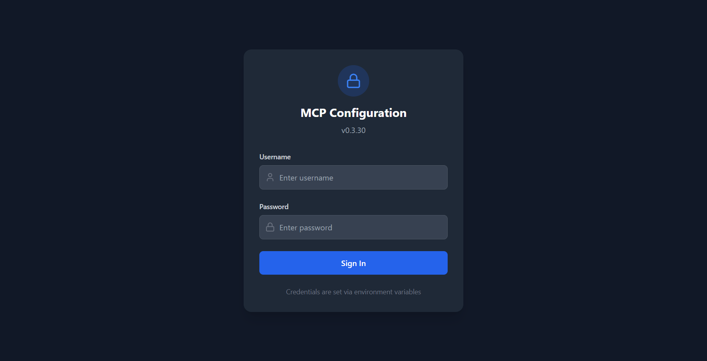

# Configuration Guide

This guide covers all configuration options for odoo-rust-mcp.

## Instance Configuration

### Multi-Instance Setup (Recommended)

Create `instances.json`:

```json
{
  "production": {
    "url": "https://prod.example.com",
    "db": "production",
    "apiKey": "prod_api_key_here"
  },
  "staging": {
    "url": "https://staging.example.com",
    "db": "staging",
    "apiKey": "staging_api_key_here"
  },
  "local": {
    "url": "http://localhost:8069",
    "db": "localdb",
    "version": "18",
    "username": "admin",
    "password": "admin"
  }
}
```

### Instance Fields

| Field | Required | Default | Description |
|-------|----------|---------|-------------|
| `url` | Yes | - | Odoo server URL |
| `db` | v<19 | - | Database name |
| `apiKey` | v19+ | - | API key for JSON-2 authentication |
| `version` | v<19 | - | Odoo version (triggers username/password mode) |
| `username` | v<19 | - | Username for JSON-RPC auth |
| `password` | v<19 | - | Password for JSON-RPC auth |
| `protocol` | No | `auto` | Protocol override: `auto`, `jsonrpc`, or `json2` |
| `timeout_ms` | No | `30000` | Request timeout in milliseconds |
| `max_retries` | No | `2` | Maximum retry attempts for failed requests |

### Protocol Selection

By default, the server auto-detects the protocol based on available credentials:

| Condition | Protocol Used |
|-----------|---------------|
| `apiKey` present | JSON-2 API (Odoo 19+) |
| `username` + `password` + `version` present | JSON-RPC (Odoo <19) |

You can override this with the `protocol` field:

```json
{
  "forced-jsonrpc": {
    "url": "https://odoo19.example.com",
    "db": "mydb",
    "username": "admin",
    "password": "admin",
    "protocol": "jsonrpc"
  }
}
```

### Single Instance (Legacy)

For simple setups, use environment variables instead of `instances.json`:

```bash
ODOO_URL=https://your-odoo.com
ODOO_DB=mydb
ODOO_API_KEY=your-key
```

---

## Environment Variables

### Core Configuration

| Variable | Default | Description |
|----------|---------|-------------|
| `ODOO_INSTANCES_JSON` | - | Path to `instances.json` file |
| `ODOO_INSTANCES` | - | Inline JSON string (takes precedence over file) |
| `ODOO_URL` | - | Single instance URL (fallback) |
| `ODOO_DB` | - | Database name |
| `ODOO_API_KEY` | - | API key for v19+ |
| `ODOO_VERSION` | - | Odoo version (triggers legacy mode) |
| `ODOO_USERNAME` | - | Username for v<19 |
| `ODOO_PASSWORD` | - | Password for v<19 |

### Feature Toggles

| Variable | Default | Description |
|----------|---------|-------------|
| `ODOO_ENABLE_WRITE_TOOLS` | `false` | Enable create/update/delete/execute tools |
| `ODOO_ENABLE_CLEANUP_TOOLS` | `false` | Enable database cleanup tools |
| `ODOO_TIMEOUT_MS` | `30000` | Request timeout in milliseconds |
| `ODOO_MAX_RETRIES` | `2` | Retry attempts for failed requests |

### MCP Configuration

| Variable | Default | Description |
|----------|---------|-------------|
| `MCP_TOOLS_JSON` | Auto | Path to `tools.json` |
| `MCP_PROMPTS_JSON` | Auto | Path to `prompts.json` |
| `MCP_SERVER_JSON` | Auto | Path to `server.json` |

### Authentication (HTTP Transport)

| Variable | Default | Description |
|----------|---------|-------------|
| `MCP_AUTH_ENABLED` | `false` | Enable Bearer token auth for MCP HTTP |
| `MCP_AUTH_TOKEN` | - | Auth token (generate: `openssl rand -hex 32`) |
| `MCP_ALLOWED_ORIGINS` | - | Comma-separated allowed CORS origins |

### Config UI

| Variable | Default | Description |
|----------|---------|-------------|
| `ODOO_CONFIG_SERVER_PORT` | `3008` | Config UI port |
| `ODOO_CONFIG_DIR` | `~/.config/odoo-rust-mcp` | Config directory path |
| `CONFIG_UI_USERNAME` | `admin` | Login username |
| `CONFIG_UI_PASSWORD` | `changeme` | Login password (**change immediately!**) |

### Logging

| Variable | Default | Description |
|----------|---------|-------------|
| `RUST_LOG` | `info` | Log level: `error`, `warn`, `info`, `debug`, `trace` |

---

## Transport Modes

### stdio (Recommended for AI Clients)

```bash
rust-mcp --transport stdio
```
- Used by Cursor, Claude Desktop, Claude Code, Windsurf
- Communication via stdin/stdout
- Config UI available on port 3008

### HTTP (Remote/Multi-user)

```bash
rust-mcp --transport http --listen 127.0.0.1:8787
```
- MCP endpoint: `POST /mcp`
- SSE stream: `GET /mcp`
- Session termination: `DELETE /mcp`
- Legacy SSE: `GET /sse`
- Legacy messages: `POST /messages`
- Health check: `GET /health`
- OpenAPI spec: `GET /openapi.json`
- Supports Bearer token authentication

### WebSocket

```bash
rust-mcp --transport ws --listen 127.0.0.1:8787
```
- For custom integrations and real-time bidirectional communication

---

## Config UI (Web Interface)

Access the visual configuration interface at `http://localhost:3008`.

### Tabs

| Tab | Purpose |
|-----|---------|
| **Server** | Edit MCP server name, instructions, protocol version |
| **Instances** | Add/edit/remove Odoo instance connections |
| **Tools** | Enable/disable tools, edit tool definitions |
| **Prompts** | Edit prompt content and descriptions |
| **Security** | Change Config UI password, manage MCP auth tokens |

### First-time Setup

1. Open `http://localhost:3008`
2. Login with `admin` / `changeme`
3. Go to **Security** tab and change the default password
4. Configure instances in **Instances** tab
5. Optionally enable MCP HTTP authentication in **Security** tab



*The default sign-in screen on port 3008. Credentials are sourced from the Config UI environment variables.*

### Hot-Reload

Changes made through the Config UI or by directly editing JSON config files take effect immediately. The file watcher detects changes and reloads the MCP registry without restarting the server.

---

## Customizing Tools

Edit `tools.json` to customize which tools are available:

### Read-only Mode

Remove write tools (`odoo_create`, `odoo_update`, `odoo_delete`, `odoo_execute`, `odoo_workflow_action`, `odoo_copy`, `odoo_create_batch`) from the `tools` array.

### Conditional Tools with Guards

Use guards to conditionally enable tools based on environment variables:

```json
{
  "name": "odoo_create",
  "guards": { "requiresEnvTrue": "ODOO_ENABLE_WRITE_TOOLS" },
  "description": "Create a new Odoo record",
  "inputSchema": { ... },
  "op": { ... }
}
```

Guard types:
- `requiresEnvTrue`: Tool only available when env var is set to `"true"`
- `requiresEnv`: Tool only available when env var is set (any value)

---

## Configuration File Locations

### User Config (Runtime)

| Platform | Directory |
|----------|-----------|
| Linux/macOS | `~/.config/odoo-rust-mcp/` |
| Windows | `%APPDATA%\odoo-rust-mcp\` or user-specified |

Files: `instances.json`, `tools.json`, `prompts.json`, `server.json`, `env`

### System Config (Service Installs)

| Platform | Directory |
|----------|-----------|
| Linux (systemd) | `/etc/rust-mcp/` |
| Linux (deb) | `/usr/share/rust-mcp/` (defaults) |
| Windows | `%ProgramData%\odoo-rust-mcp\` |

### Config Resolution Order

1. Environment variable (e.g., `MCP_TOOLS_JSON=/custom/path/tools.json`)
2. User config directory (`~/.config/odoo-rust-mcp/tools.json`)
3. Embedded defaults (compiled into binary from `config-defaults/`)

---

## Deployment Options

| Method | Best For |
|--------|----------|
| Binary + stdio | Local development, single AI client |
| Binary + HTTP | Remote access, multiple users |
| Docker | Quick deployment, isolation |
| Docker Compose | Multi-service setups (n8n, Dify) |
| Kubernetes | Production, high availability |
| Helm | Production, customizable deployment |
| systemd | Linux background service |
| Windows Service | Windows background service |

See [Deployment Guide](./deployment.md) for detailed instructions.

---

## Configuration FAQ & Best Practices

### MCP Client vs Server Config

There are two distinct layers of configuration in the MCP ecosystem:

1.  **MCP Client Config** (`claude_desktop_config.json` or `.mcp.json`)
    *   **Role**: Tells the AI client (Claude Desktop, Claude Code) *how to run* the MCP server binary.
    *   **Content**: Binary path, command-line arguments (e.g., `--transport stdio`), and environment variables.
    *   **Example**: "Run `rust-mcp.exe` and give it access to `instances.json`".

2.  **MCP Server Config** (`instances.json`, `tools.json`)
    *   **Role**: Tells the MCP server *how to connect* to Odoo and *what tools* to expose.
    *   **Content**: Odoo URLs, databases, API keys, tool definitions.
    *   **Example**: "Connect to `https://odoo-prod.com` using API key `xyz`".

### Best Practices

1.  **Use API Keys for Odoo 19+**
    *   Always prefer API keys over username/password.
    *   API keys are stateless, more secure, and easier to revoke.

2.  **Project-Specific Config**
    *   Use `.mcp.json` in your project root for project-specific MCP settings (supported by Claude Code).
    *   This allows you to share MCP configurations with your team without requiring global setup.

    ```json
    // .mcp.json in project root
    {
      "mcpServers": {
        "odoo": {
          "command": "rust-mcp",
          "args": ["--transport", "stdio"],
          "env": {
            "ODOO_INSTANCES_JSON": "${PWD}/instances.json"
          }
        }
      }
    }
    ```

3.  **Security**
    *   **Never commit `instances.json`** to version control if it contains real credentials. Add it to `.gitignore`.
    *   Use separate instances for Development (`localhost`) and Staging/Production.

### Authentication Methods: API Key vs Username/Password

| Feature | API Key (Recommended) | Username/Password (Legacy) |
| :--- | :--- | :--- |
| **Supported Versions** | Odoo 19+ (JSON-2 API) | All Versions (JSON-RPC) |
| **Security** | High (Revocable, Scoped) | Medium (Exposes User Credentials) |
| **Performance** | Stateless (1 Request) | Stateful (Login + Session) |
| **Configuration** | Simple (`url`, `db`, `apiKey`) | Complex (`url`, `db`, `version`, `user`, `pass`) |

**Recommendation**: Use API Keys whenever possible. Only use Username/Password for Odoo 17/18 or if you specifically need legacy JSON-RPC behavior.
